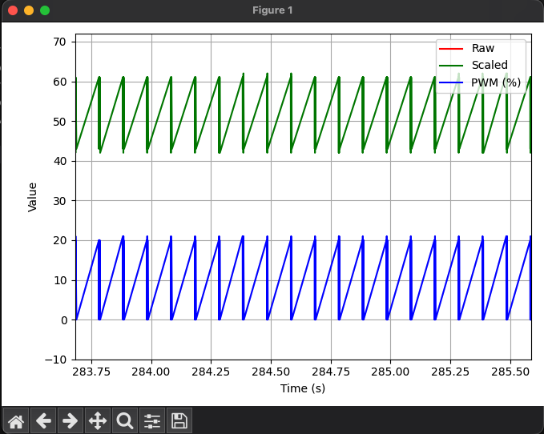
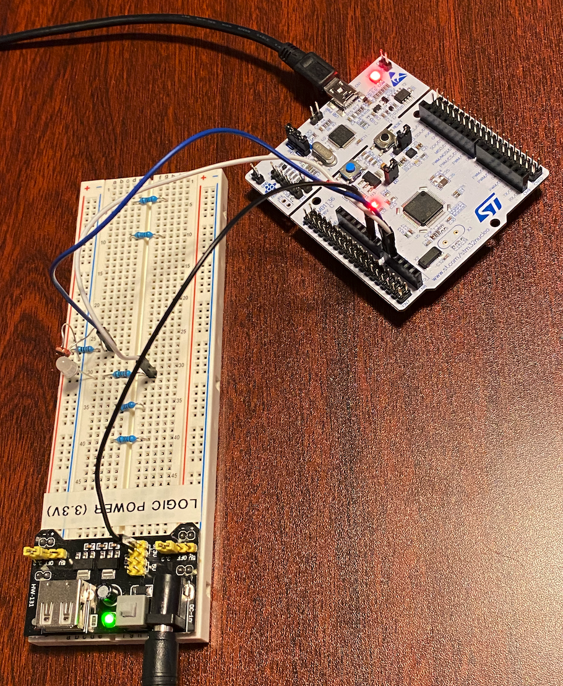
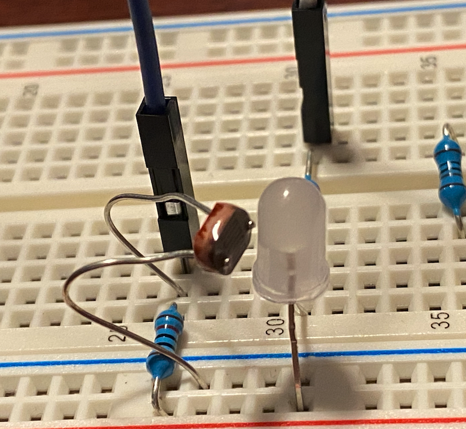

# PID Learning Lab

This repository documents my learning concepts of PID control, inspired by the *PID Without a PhD* article. The goal is to progressively implement and understand various control strategies using simple, observable hardware: a bright LED and a CDS-55 photoresistor.

## Hardware Setup
- **LED**: Output actuator (brightness control)
- **CDS-55 Photoresistor**: Light sensor (analog voltage)
- **MCU**: STM32F446RE (or equivalent)
- **ADC & PWM**: For reading light levels and controlling brightness

## Learning Stages

Each folder documents a distinct control strategy:
1. `01-onoff_control` — Basic bang-bang control
2. `02-proportional_control` — Smooth response with proportional feedback

Additional stages for PI and full PID control will be added as development continues.

Each stage includes:
- Firmware source code
- Logged output and plots (if applicable)
- Notes on tuning, behavior, and lessons learned

## Tools
- STM32CubeIDE / STM32CubeMX
- UART for debug output (can be redirected to SD card or serial plotter)
- Optional: Python or Excel for plotting logs

## Reference
[PID Without a PhD](https://brettbeauregard.com/blog/2011/04/improving-the-beginner’s-pid-introduction/)

---

### Images of Hardware Setup and Results

Note: The image shows the LED brightness response with Kp set to 1.2, demonstrating the system's behavior under proportional control.

Note: This image shows the hardware setup with the STM32F446 Nucleo board, LED, and CDS-55 photoresistor connected to a breadboard with an external 3.3V supply.

Note: The photoresistor is positioned relative to the LED, covered to minimize noise from ambient light during testing.